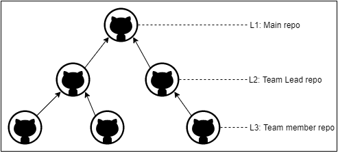

# Contributing

We will be using Github for development and version control.

## Hierarchy

The workflow hierarchy will be as follows.

- L1 - The main repo: maintained by project manager and technical architect
- L2 - Team leads repo
- L3 - Team members repo

## Workflow

#### Team Members

- Fork the repo of their respective team leads.
- Raise issue's in the team leads repo. 
- Raise issues for every feature implementation.
- Make pull requests in the team leads repo.
- Make sure the pull requests are linked with the issue raised.
- **Make sure to do unit testing before making pull requests**

#### Team Leads

- Fork the main repo.
- Raise issue's in the main repo.
- Raise issues for every feature implementation.
- Make pull requests in the main repo.
- Make sure the pull requests are linked with the issue raised.
- **Make sure to do regression testing before making pull requests**

#### Project Manager & Technical Architect

- Maintains the main repo, and will make the final call for merging the pull requests.

## Coding guidelines

- [C# Coding Conventions - Official](https://docs.microsoft.com/en-us/dotnet/csharp/fundamentals/coding-style/coding-conventions)
- [C# Coding Conventions - Well documented](https://github.com/ktaranov/naming-convention/blob/master/C%23%20Coding%20Standards%20and%20Naming%20Conventions.md)
- [C# Best Practices - geeksforgeeks](https://www.geeksforgeeks.org/c-sharp-coding-standards/)

## Useful Links
- [Using GIT](https://docs.github.com/en/github/using-git)
- [Commits](https://docs.github.com/en/github/committing-changes-to-your-project)
- [Issues and PR](https://docs.github.com/en/github/managing-your-work-on-github/managing-your-work-with-issues)
- [Labelling Issues](https://docs.github.com/en/github/managing-your-work-on-github/labeling-issues-and-pull-requests)
- [Linking a PR to an issue](https://docs.github.com/en/github/managing-your-work-on-github/linking-a-pull-request-to-an-issue)
